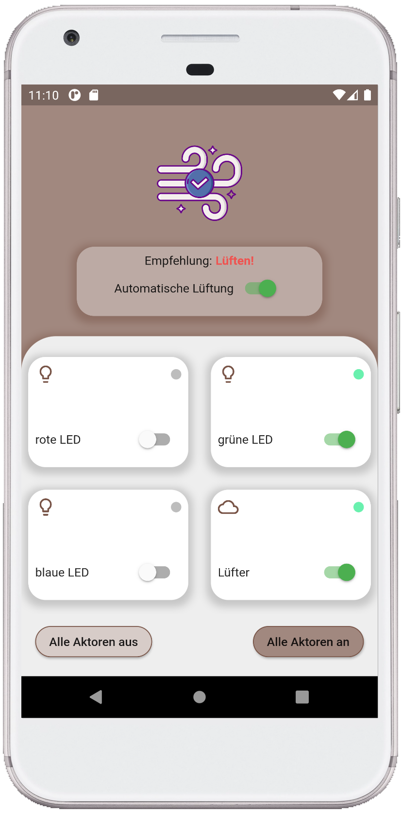

# thesis_demo

Demo thesis project.

## Getting Started

This project is part of a smart home kit. It enables the mobile control
of devices within a local network. In order to use the app, a Node-RED
server is required to handle incoming requests.

# Screenshot

